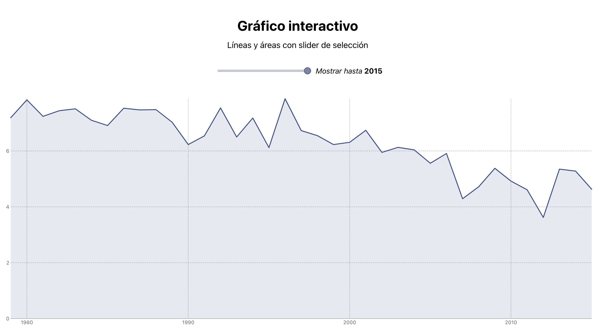

# VD | Dataviz gráficos
Maqueta inicial para varios tipos de gráficos de la librería [LayerCake](https://layercake.graphics/). 

## Librería de gráficos LayerCake
Layer Cake es un framework para Svelte. Utiliza las medidas del div contenedor y los datos para crear escalas que permanecen sincronizadas con los cambios de diseño. 
## Galería de Componentes
https://layercake.graphics/components

---